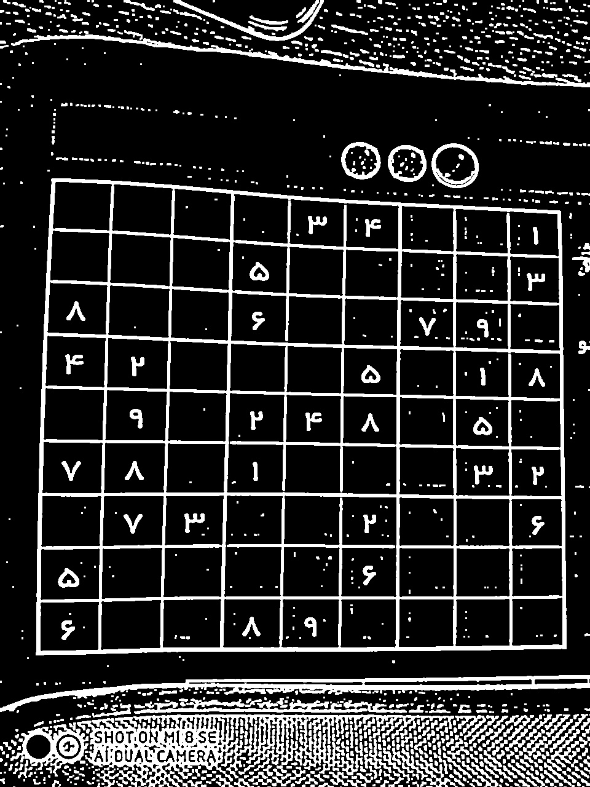
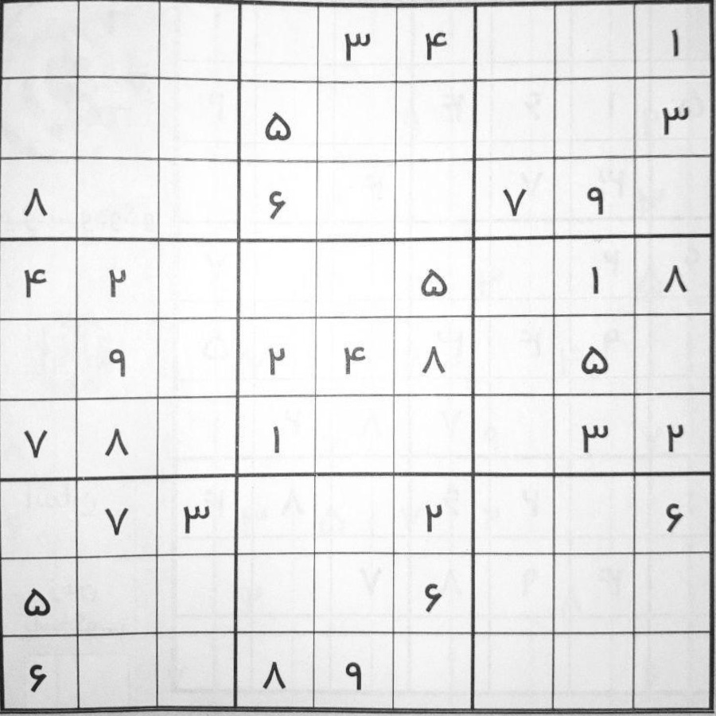
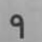
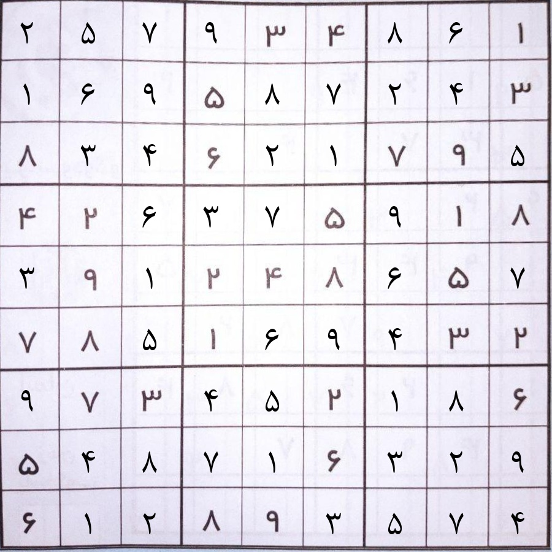
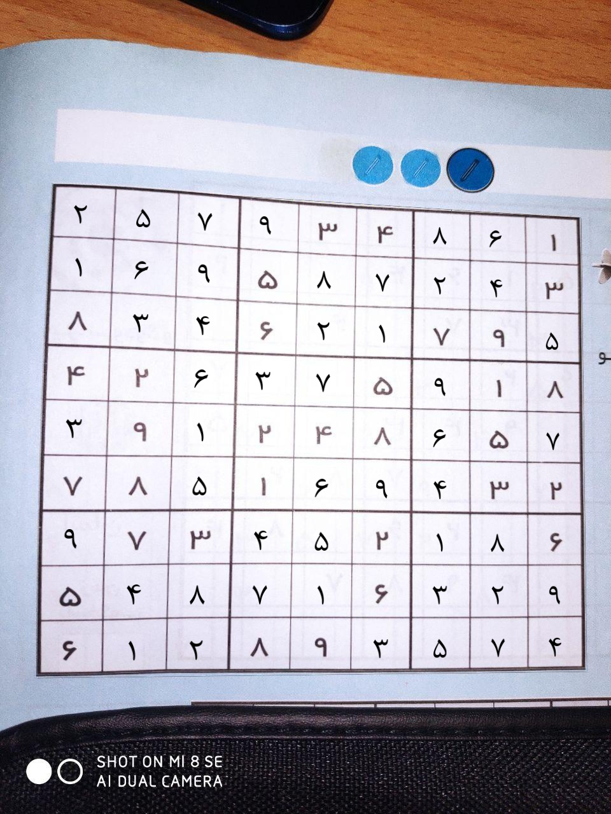

# Realtime-AR-Sudoku-Solver

An augmented reality sudoku solver using OpenCV.

## Usage

### Installation
>pip install -r requirements.txt

## Introduction
In order to getting images ip_camera app and webcam images are used 

### Step 1
``` python
def process(img):
kernel = cv2.getStructuringElement(cv2.MORPH_RECT, ( 2 , 2 ))
greyscale = img if len(img.shape) == 2 else cv2.cvtColor(img, cv2.COLOR_BGR2G
RAY)
denoise = cv2.GaussianBlur(greyscale, ( 9 , 9 ), 0 )
thresh = cv2.adaptiveThreshold(denoise, 255 , cv2.ADAPTIVE_THRESH_GAUSSIAN_C,
cv2.THRESH_BINARY, 11 , 2 )
inverted = cv2.bitwise_not(thresh, 0 )
morph = cv2.morphologyEx(inverted, cv2.MORPH_OPEN, kernel)
dilated = cv2.dilate(morph, kernel, iterations= 1 )
return dilated
```
this function used to find make binray image in order to find the four corner of the sudoku table

### Step 2
``` python
def get_corners(img):
    contours, hire = cv2.findContours(img, cv2.RETR_EXTERNAL, cv2.CHAIN_APPROX_SIMPLE)
    contours = sorted(contours, key=lambda x: cv2.contourArea(x), reverse=True)
    if len(contours) > 0 :
        largest_contour = np.squeeze(contours[ 0 ])
        sums = [sum(i) for i in largest_contour]
        differences = [i[ 0 ] - i[ 1 ] for i in largest_contour]
        top_left = np.argmin(sums)
        top_right = np.argmax(differences)
        bottom_right = np.argmax(sums)
        bottom_left = np.argmin(differences)
        corners = [largest_contour[top_left], largest_contour[top_right], largest_contour[bottom_left],
        largest_contour[bottom_right]]
        corners = np.float32(corners)
        return corners
    raise ValueError("NO CONTURE")
```
Contours has been used to find the four corner of table

### Step 3

```python3
get_block_num(block)
```
In this part a keras conv neuralnet network has been loaded which has been trained on the HODA-Farsi-Digits dataset.
there were weaknesses on the detection of some digits therefore we use image augmentation to improve the results.\
```python3
get_block_num_TM(block)
```
The other method that is used for digit detection was Template-Matching which by the way got the better accuracy that ANN. 
### Step 4

### Step 5


chr